# gadgetplots

**Plot gadget3 model output using ggplot2. R package version 0.1.1**

<!-- badges: start -->

[](https://github.com/gadget-framework/gadgetplots/actions)
<!-- badges: end -->

The gadgetplots package produces diagnostics graphics for
[gadget3](https://github.com/gadget-framework/gadget3) using
[ggplot2](https://ggplot2.tidyverse.org/reference). The package replaces
the plotting capabilities of
[Rgadget](https://github.com/gadget-framework/rgadget) package which was
designed to work with
[gadget2](https://github.com/gadget-framework/gadget2).

## Installation

The gadgetplots is not available on CRAN yet. Use the devtools or
remotes packages to install directly from GitHub:

``` r
# install.packages("devtools")
devtools::install_github("gadget-framework/gadgetplots")
```

## Overview of plots

The package produces generally similar plots to
[Rgadget](https://github.com/gadget-framework/rgadget). Names and
apperances of these plots have changed somewhat. There are two ways to
produce the plots: either use a specific `plot_*()` or the generic
`plot()` with `param` argument specifying the type of plot.

Load example data to demonstrate the plots:

``` r
library(gadgetplots)
data(fit) # Note that we'll need a better example dataset
```

### Annual (ICES) plot

``` r
plot_annual(fit) # synonym: plot(fit, "annual")
```

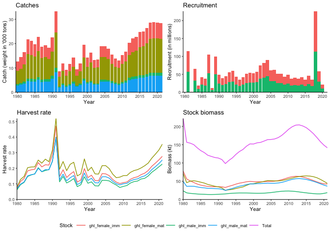<!-- -->

### Stock biomass and abundance

``` r
plot_biomass(fit, total = TRUE) # synonym: plot(fit, "total")
```

<!-- -->

``` r
plot_biomass(fit, geom_area = TRUE) # synonym: plot(fit, "biomass", geom_area = TRUE)
```

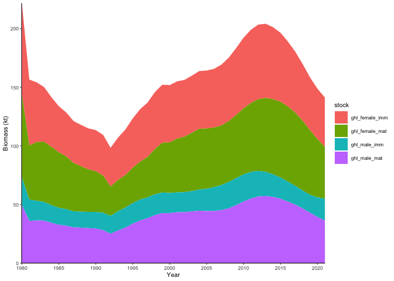<!-- -->

``` r
plot_biomass(fit, biomass = FALSE) # synonym: plot(fit, "abundance")
```

<!-- -->

### Spawning stock

Currently requires definition of spawning stock among stocks in the
gadget model (uses a reasonable guess: `grep("fem.*mat")`). Defining
spawning stock based on length or age from the model is also possible,
but needs to be implemented.

``` r
plot_ssb(fit) # synonym: plot(fit, "ssb")
```

<!-- -->

### Recruitment

``` r
plot_rec(fit) # synonym: plot(fit, "rec")
```

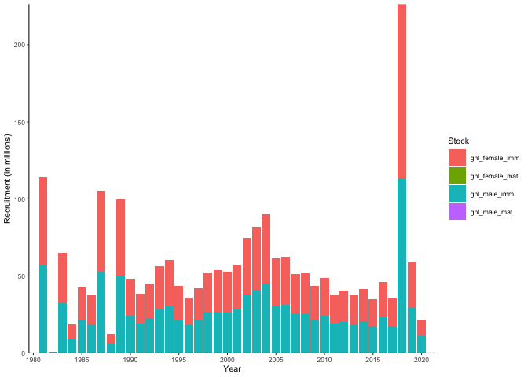<!-- -->

### Fishing mortality (F)

``` r
plot_f(fit) # synonym: plot(fit, "f")
```

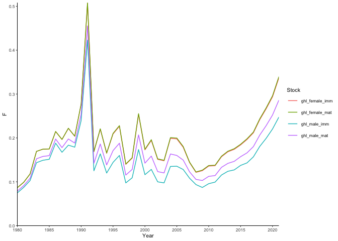<!-- -->

### Modeled catches and harvest rate

``` r
plot_catch(fit, type = "stock") # synonym: plot(fit, "catch")
```

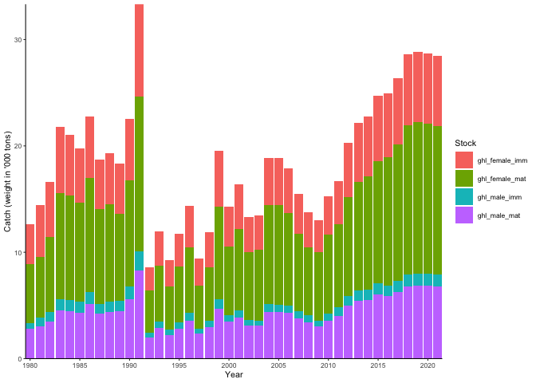<!-- -->

``` r
plot_catch(fit, type = "fleet") # synonym: plot(fit, "fleet")
```

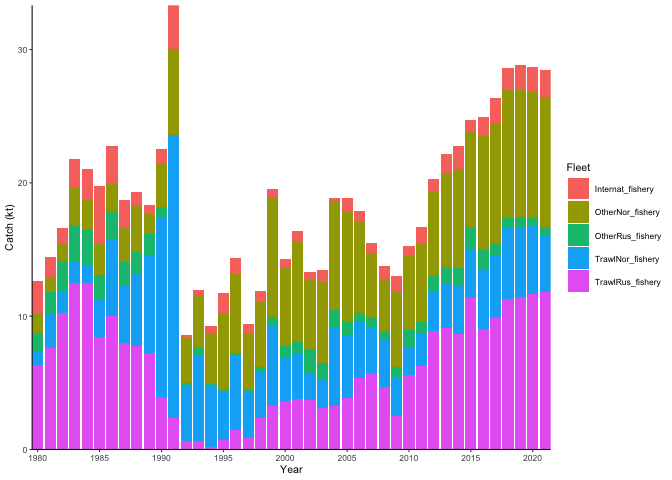<!-- -->

``` r
plot_catch(fit, type = "hr") # synonym: plot(fit, "hr")
```

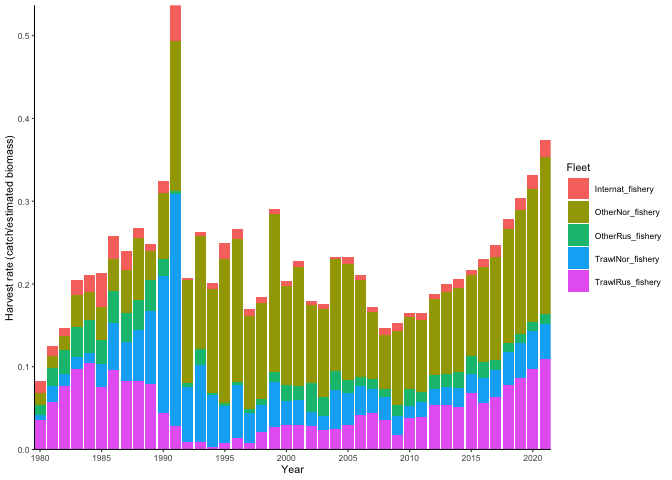<!-- -->

### Survey indices

``` r
plot_si(fit) # synonym: plot(fit, "si")
```

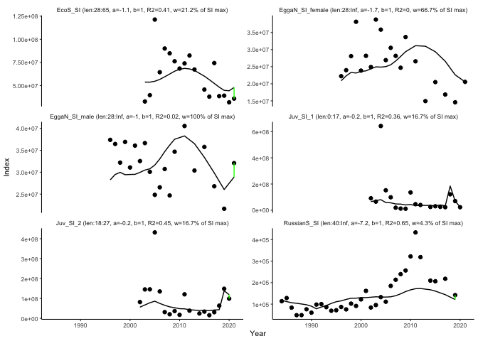<!-- -->

### Catch distribution

The function typically produces a list of plots. Here only one to save
space

``` r
plot_catchdist(fit, name = "EggaN_ldist") # synonym: plot(fit, "catchdist")
#> $EggaN_ldist
```

<!-- -->

### Stock distribution

``` r
plot_stockdist(fit) # synonym: plot(fit, "stockdist")
```

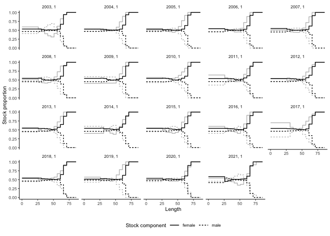<!-- -->

### Suitability (fleet selection)

``` r
plot_suitability(fit) # synonym: plot(fit, "suitability")
```

<!-- -->

### Growth

``` r
plot_growth(fit) # synonym: plot(fit, "growth")
```

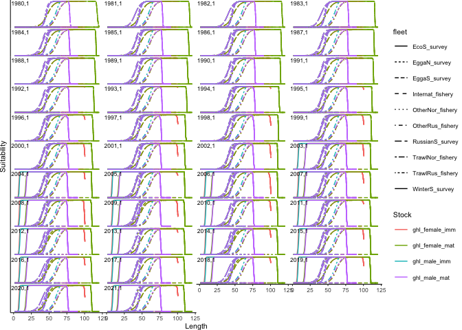<!-- -->

### Age-length fit

Returns as many plots as there are separate age-length data sources.
Only one plotted here to save space.

``` r
plot_agelength(fit, name = "EggaN_aldist_female") # synonym: plot(fit, "agelength")
#> $EggaN_aldist_female
```

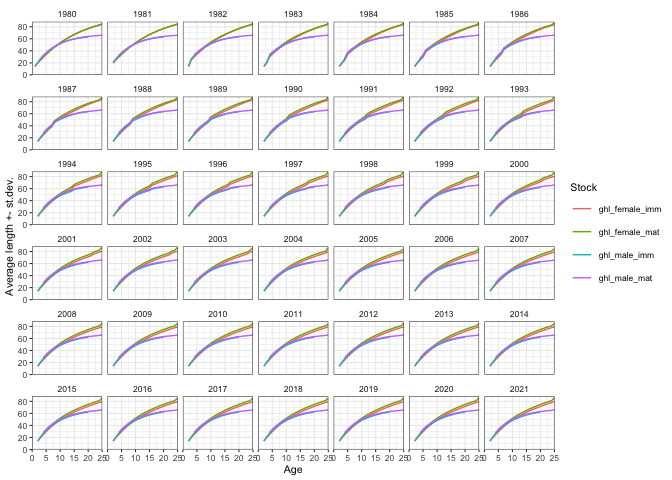<!-- -->

### Age composition

``` r
plot_agecomp(fit) # synonym: plot(fit, "agecomp"), also "stock.std" works
```

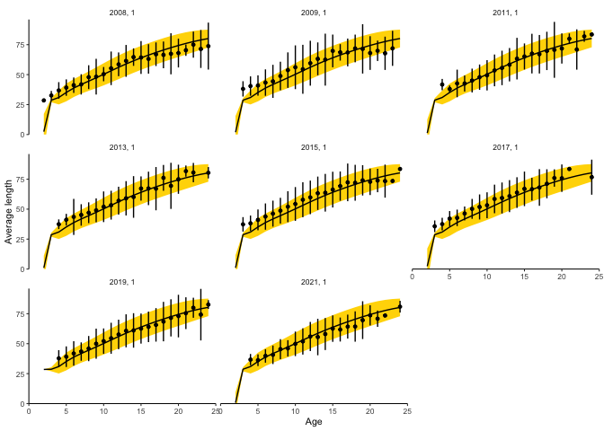<!-- -->

### Residuals

``` r
plot_resid(fit) # synonym: plot(fit, "resid")
```

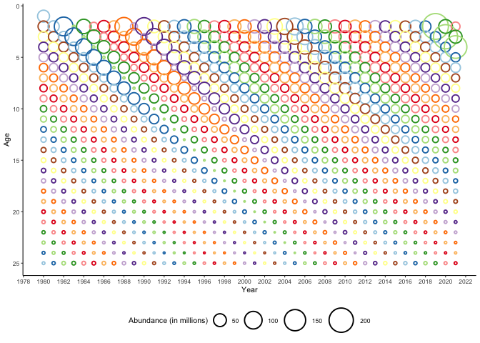<!-- -->

### Likelihood

``` r
plot_likelihood(fit) # synonym: plot(fit, "likelihood")
```

<!-- -->

``` r
plot_likelihood(fit, type = "weighted") # synonym: plot(fit, "weighted")
```

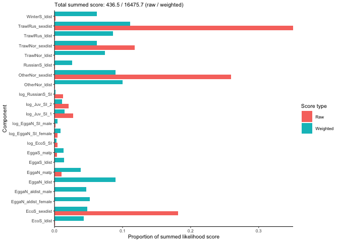<!-- -->

``` r
plot_likelihood(fit, type = "pie") # synonym: plot(fit, "pie")
```

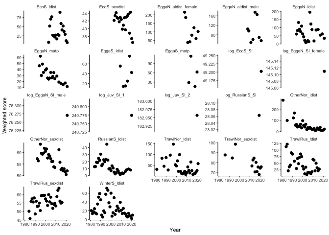<!-- -->

## Quickly plot central diagnostics

The `gadget_plot()` produces a range of diagnostic plots into a folder
specified by the `path` argument. You may also use the
`file_type = "html"` argument to save these plots into a single html
file. There is also the `plot_html()` to produce the html file directly
without a wrapper function.

## Found a bug or desire a feature?

The package is under an active development together with gadget3
framework. Please report bugs and write feature requests under
[Issues](https://github.com/gadget-framework/gadgetplots/issues).
